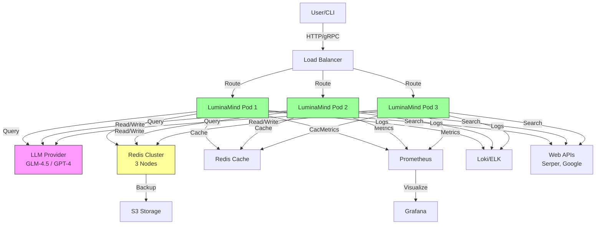
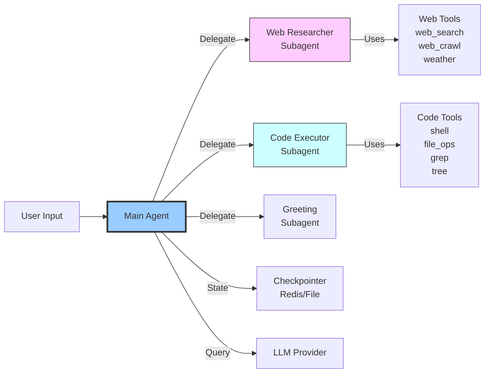
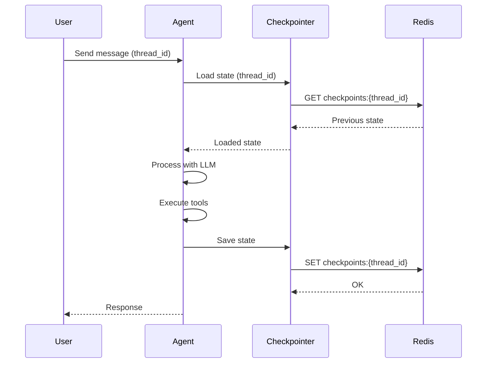
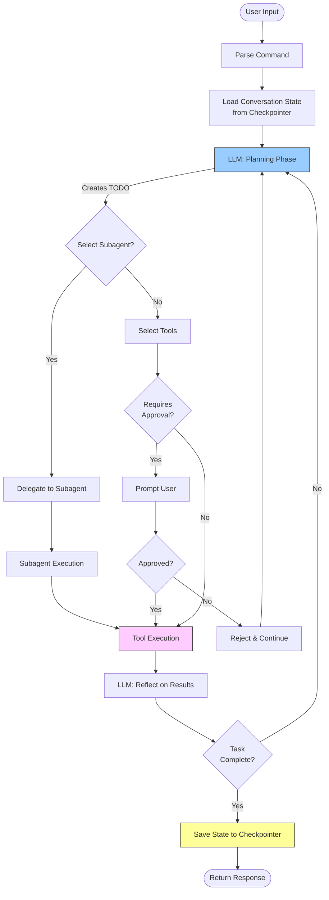
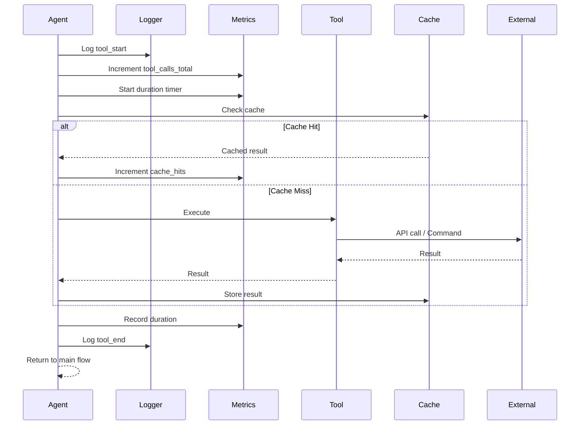
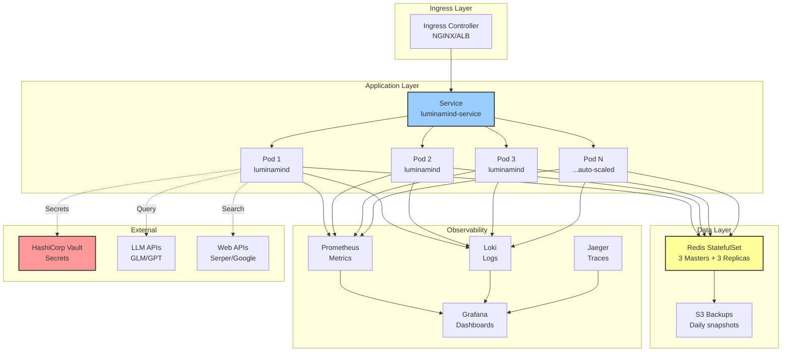
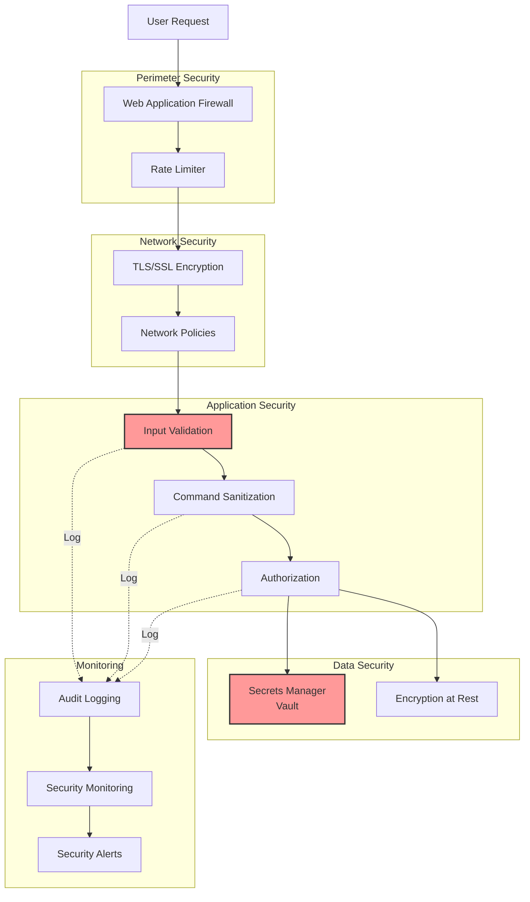
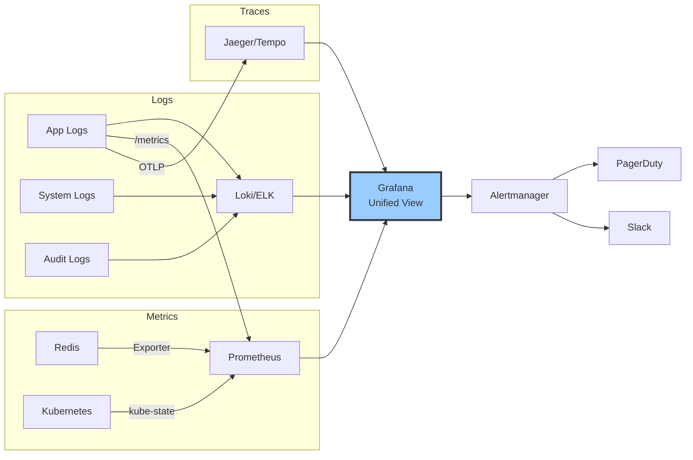
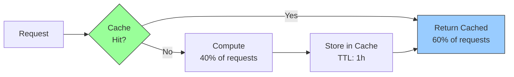
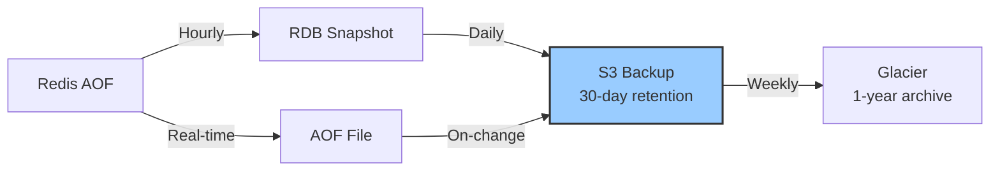

# System Architecture
## LuminaMind Deep Agent Framework

> **Status**: Production Readiness Planning  
> **Last Updated**: November 26, 2025  
> **Version**: 0.0.1.1.3

---

## Overview

LuminaMind is a multi-agent autonomous AI system built on LangGraph, designed for code analysis, web research, and software development automation.

### Architecture Principles

1. **Modularity**: Pluggable tool system
2. **Resilience**: Circuit breakers, retries, graceful degradation
3. **Observability**: Comprehensive logging, metrics, tracing
4. **Scalability**: Horizontal scaling via Kubernetes
5. **Security**: Defense in depth, least privilege

---

## High-Level Architecture



---

## Component Architecture

### 1. Agent Core



**Main Agent** (`luminamind/deep_agent.py`):
- Orchestrates subagents
- Manages conversation state
- Handles human-in-the-loop approvals
- Routes tasks to specialized subagents

**Subagents**:
1. **Web Researcher**: Deep research, fact gathering, web search
2. **Code Executor**: File operations, shell commands, code analysis
3. **Greeting Responder**: Casual conversation, greetings

### 2. Tool Ecosystem

```mermaid
graph TB
    subgraph "File Tools"
    Read[read_file]
    Write[write_file]
    Copy[copy_file]
    Delete[delete_file]
    List[list_directory]
    Search[file_search]
    end
    
    subgraph "Web Tools"
    WebS[web_search]
    WebC[web_crawl]
    Weather[get_weather]
    Fetch[fetch_as_markdown]
    end
    
    subgraph "Code Tools"
    Shell[shell]
    Grep[grep_search]
    Tree[tree_view]
   MultiReplace[multi_replace_in_file]
    Patch[apply_patch]
    end
    
    subgraph "System Tools"
    OSInfo[os_info]
    Safety[safety checks]
    end
    
    Agent[Main Agent] --> File Tools
    Agent --> Web Tools
    Agent --> Code Tools
    Agent --> System Tools
```

**Tool Registry** (`luminamind/py_tools/registry.py`):
```python
PY_TOOL_REGISTRY = {
    "os_info": os_info,
    "shell": shell,
    "web_search": web_search,
    "web_crawl": web_crawl,
    "get_weather": get_weather,
    # ... more tools
}
```

### 3. State Management



**Checkpointer** (`luminamind/config/checkpointer.py`):
- **Primary**: `RedisBackedMemorySaver` (production)
- **Fallback**: `FileBackedMemorySaver` (development)
- **Interface**: LangGraph `MemorySaver`

**State Includes**:
- Message history
- Tool execution results
- Pending approvals
- Agent metadata

### 4. LLM Provider Abstraction

```python
def get_llm():
    provider = os.environ.get("LLM_PROVIDER", "openai")
    
    if provider == "ollama":
        return ChatOllama(
            model=os.environ.get("OLLAMA_MODEL", "qwen3:latest"),
            base_url=os.environ.get("OLLAMA_BASE_URL"),
            temperature=0.7,
            streaming=True
        )
    
    return ChatOpenAI(
        temperature=0.7,
        model="glm-4.5-flash",
        openai_api_key=os.environ.get("GLM_API_KEY"),
        openai_api_base="https://api.z.ai/api/paas/v4/",
        streaming=True
    )
```

**Supported Providers**:
- **OpenAI-compatible**: GLM-4.5-Flash (default)
- **Ollama**: Local models (qwen3, llama3, etc.)

---

## Data Flow

### Request Processing Flow



### Tool Execution with Observability



---

## Production Architecture

### Kubernetes Deployment



### Resource Allocation

**Per Pod**:
- **CPU**: 500m request, 2000m limit
- **Memory**: 512Mi request, 2Gi limit
- **Replicas**: Min 3, Max 10
- **Auto-scale trigger**: CPU >70% or Memory >80%

**Redis Cluster**:
- **Nodes**: 3 masters + 3 replicas
- **Memory**: 4Gi per node
- **Persistence**: AOF + RDB snapshots
- **Backup**: Daily to S3

---

## Security Architecture

### Defense in Depth



### Security Controls

1. **Input Validation**:
   - Pydantic schemas for all inputs
   - Command whitelist for `shell` tool
   - Path validation for file operations

2. **Secrets Management**:
   - HashiCorp Vault for API keys
   - Kubernetes secrets for configs
   - No secrets in code or logs

3. **Network Security**:
   - TLS 1.3 for all external communication
   - Network policies in Kubernetes
   - Private subnets for data layer

4. **Audit Logging**:
   - All tool executions logged
   - User actions tracked
   - Security events alerted

---

## Observability Architecture

### The Three Pillars



### Key Dashboards

1. **Application Health**
   - Request rate, error rate, latency (RED metrics)
   - Tool usage distribution
   - LLM token consumption
   - Cache hit rate

2. **Infrastructure Health**
   - Pod CPU/memory usage
   - Redis performance
   - Network I/O
   - Disk usage

3. **Business Metrics**
   - Accuracy rate
   - User satisfaction
   - Cost per request
   - Active users

### Alert Rules

| Alert | Condition | Severity | Action |
|-------|-----------|----------|--------|
| High Error Rate | >1% | Critical | Page on-call |
| Slow Response | P95 >10s | Warning | Investigate |
| Pod Crash Loop | >3 restarts/10min | Critical | Page on-call |
| Redis Down | Unavailable | Critical | Auto-failover + page |
| Low Accuracy | <90% | Warning | QA review |
| High Token Usage | >2x baseline | Info | Cost alert |

---

## Scalability

### Horizontal Scaling

**Auto-scaling Triggers**:
```yaml
metrics:
- type: Resource
  resource:
    name: cpu
    target:
      averageUtilization: 70
- type: Resource
  resource:
    name: memory
    target:
      averageUtilization: 80
- type: Pods
  pods:
    metric:
      name: request_rate
    target:
      type: AverageValue
      averageValue: "100"  # RPS per pod
```

**Scale Strategy**:
- **Min replicas**: 3 (HA requirement)
- **Max replicas**: 10 (cost ceiling)
- **Scale up**: Add pod when CPU >70% for 2 minutes
- **Scale down**: Remove pod when CPU <30% for 5 minutes

### Performance Optimization

**Caching Strategy**:


**Expected Performance**:
- **Without cache**: 100% requests hit LLM/tools
- **With cache (60% hit rate)**: 40% requests hit LLM/tools
- **Cost savings**: ~50% on LLM API costs
- **Latency improvement**: P95 from ~8s to ~3s

---

## Disaster Recovery

### Backup Strategy



**Backup Schedule**:
- **Real-time**: AOF (Append-Only File)
- **Hourly**: RDB snapshots
- **Daily**: S3 upload (retain 30 days)
- **Weekly**: Glacier archive (retain 1 year)

**Recovery Procedures**:

1. **Pod Failure** (RTO: <30s)
   - Kubernetes auto-restarts
   - Load balancer routes to healthy pods

2. **Redis Failure** (RTO: <2min)
   - Redis Sentinel promotes replica to master
   - Pods reconnect automatically

3. **Complete Cluster Loss** (RTO: <30min)
   - Restore from latest S3 backup
   - Recreate Redis cluster
   - Redeploy pods

### Recovery Targets

| Scenario | RTO | RPO | Procedure |
|----------|-----|-----|-----------|
| Pod crash | <30s | 0 | Auto-restart |
| Redis node down | <2min | <1s (AOF) | Sentinel failover |
| Availability zone | <5min | <1min | Cross-AZ replica |
| Region failure | <30min | <1hour | S3 restore |

---

## Technology Stack

### Core Framework
- **Agent**: LangGraph 1.0.3
- **LLM Integration**: LangChain 1.0.8
- **LLM Providers**: OpenAI-compatible (GLM-4.5), Ollama

### Infrastructure
- **Container Orchestration**: Kubernetes
- **State Management**: Redis 5.0.4
- **Secrets**: HashiCorp Vault
- **Load Balancing**: Kubernetes Service / Ingress

### Observability
- **Logging**: Structlog + Loki/ELK
- **Metrics**: Prometheus + Grafana
- **Tracing**: OpenTelemetry + Jaeger
- **Alerting**: Alertmanager + PagerDuty

### Development
- **Language**: Python 3.12
- **Package Manager**: Poetry
- **Testing**: Pytest
- **CI/CD**: GitHub Actions

---

## Future Enhancements

### Phase 1 (Q1 2026)
- [ ] Multi-tenancy support
- [ ] Advanced caching (semantic similarity)
- [ ] Fine-tuned domain models

### Phase 2 (Q2 2026)
- [ ] Multi-region deployment
- [ ] GraphQL API
- [ ] Real-time collaboration

### Phase 3 (Q3 2026)
- [ ] Plugin marketplace
- [ ] Advanced analytics
- [ ] Custom agent training

---

**Architecture Owner**: Engineering Lead  
**Last Review**: November 26, 2025  
**Next Review**: Quarterly  
**RFC Process**: [Submit architecture proposals](https://github.com/yourorg/luminamind/rfcs)
